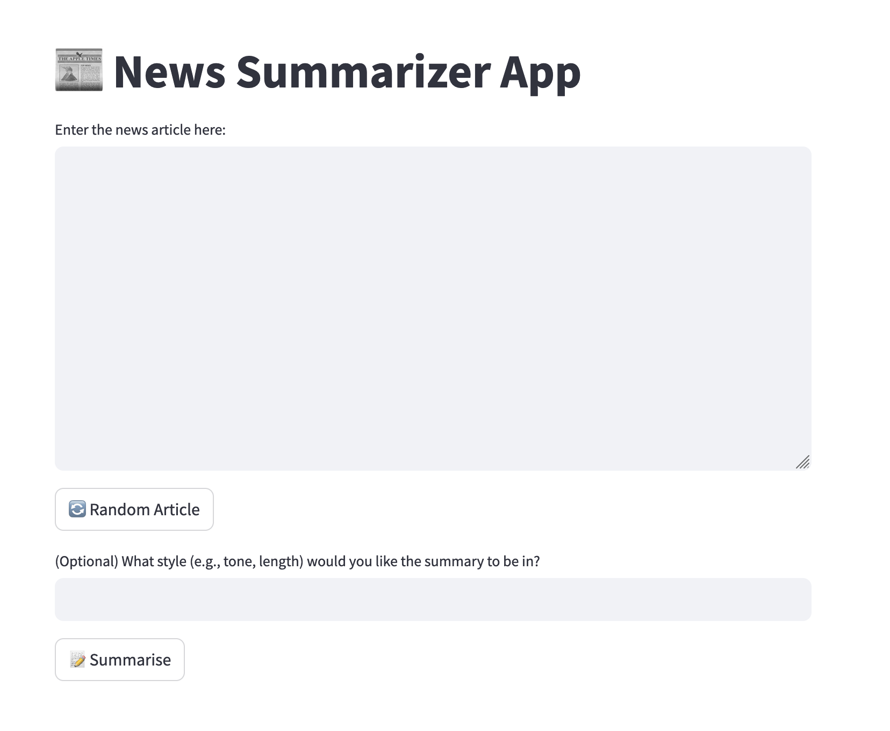
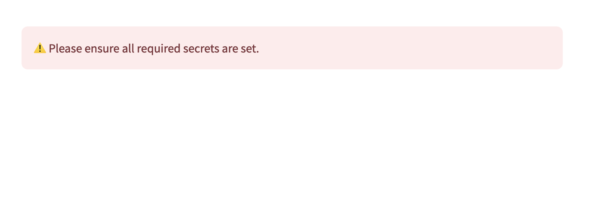

# Responsible AI Guardrails Workshop

> Through this workshop, you'll learn how to build secure and reliable LLM applications by incorporating LLM guardrails. Starting with a foundational case study, we'll progressively enhance an app using both basic and advanced guardrail techniques. 🔐 You'll also get an introduction to Sentinel, our suite of guardrails for everything from prompt injection prevention to toxicity detection. 👩‍💻 
>
> This workshop is ideal for developers and tech enthusiasts familiar with LLM APIs and looking to deepen their knowledge in building robust applications.

This repository contains the code for the Responsible AI Guardrails Workshop by GovTech AI Practice. You can find out more about our work [here](https://medium.com/dsaid-govtech).

**Prerequisites:** Basic knowledge of Python and LLMs (e.g., able to make an LLM API call)

## Context
In this workshop, we'll be working with a simple news summarizer app. Users can provide a news article and optionally specify a style for the summary. The LLM will then generate a summary of the news article.

There are a number of LLM safety vulnerabilities in this app. For this workshop, your goal is to enhance the safety of the app. We'll progressively find these vulnerabilities and add guardrails to fix them. See [activities.md](./activities.md) for more details.

## Need a reference?
Some useful helper functions are done up in [guardrails.py](./guardrails.py)

You may also refer to:
- the example app ([example_app.py](./example_app.py) which is the same application demonstrated during the workshop and incorporates the techniques taught.
- [guardrail_examples.ipynb](./guardrail_examples.ipynb) which shows how the functions in `guardrails.py` can be used.

## Set-up

> If you need assistance with the setup, please arrive 10-15 minutes early.

For this workshop, we'll be using GitHub Codespaces.

### 1. Fork this repo

### 2. Set your secrets

We will need to set the following secrets:

- `OPENAI_API_KEY`: Your OpenAI API key
- `SENTINEL_API_ENDPOINT`: Your Sentinel API endpoint
- `SENTINEL_API_KEY`: Your Sentinel API key

Please follow these steps to set the secrets:

```
a. Click on the `Settings` tab of this repository on the top bar.
b. Under the `Security` section of the sidebar, click `Secrets and variables`, and select `Codespaces`.
c. Click `New secret`.
d. Fill up the `Name` and `Value` fields based on the information provided by the workshop instructor.
e. Click `Add secret`.

Repeat step c-e for the remaining secrets.
```

For more general advice on how to secure your OpenAI API key, see [here](https://help.openai.com/en/articles/5112595-best-practices-for-api-key-safety).

### 3. Launch the Codespace

Click the badge below to launch the Codespace.

[](https://github.com/codespaces/new)

For under `Repository`, select the repo you created through Step 1.


### 4. Install the requirements

Once the Codespace is launched, install the requirements with the following command:

```
pip install -r requirements.txt
```

### 5. Run the app

Run the app with the following command:
```
streamlit run app.py
```

You should see the following screen:



If you see the following instead, please ensure that all the required secrets (`OPENAI_API_KEY`, `SENTINEL_API_ENDPOINT`, `SENTINEL_API_KEY`) are set.


